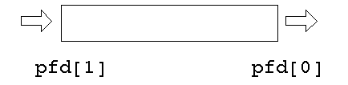

### `pfd[0]` vs `pfd[1]`
When you call: 
```C
int pfd[2];
pipe(pfd);
```
- `pfd[0]` -> read end
- `pfd[1]` -> write end

```plain text
write here ---> [ PIPE ] ---> read here
   pfd[1]                      pfd[0]
```

Fork:
```C
pid_t pid = fork();
```

to
