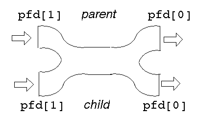

*This project has been created as part of the 42 curriculum by leilai.*

# Pipex

## Description

**pipex** is a program that reproduces the behavior of a shell pipeline.

It executes two commands with input and output redirection, behaving exactly like:

```bash
< file1 cmd1 | cmd2 > file2
```

The goal of this project is not just to execute commands, but to understand how a UNIX shell internally handles:
- processes
- pipes
- file descriptors
- program execution

This project focuses on:
- system-level programming
- process management
- UNIX I/O mechanisms

---

## Instructions
### Compilation
```bash
make
```
### Execution
```bash
./pipex file1 "cmd1" "cmd2" file2
```
```
Basic test
```bash
./pipex infile "grep a" "wc -l" outfile
```
Compare with shell
```bash
./pipex infile "grep a" "wc -l" outfile1
< indile grep a | wc -l > outfile2
diff outfile1 outfile2
```
Edge cases
```bash
./pipex nofile "grep a" "wc -l" outfile
./pipex infile "fakecmd" "wc -l" outfile
```
Also test:
```bash
./pipex infile "grep a1" "wc -w" outfile
./pipex infile "ls -l" "wc -l" outfile
```
---

## Project Overview

The program takes 4 arguments:
- file1 → input file
- cmd1 → first command
- cmd2 → second command
- file2 → output file

It must behave exactly like a shell pipeline.

---

## How a Pipe Works

### `ls | wc`
take the output of `ls`, feed it as input into `wc`

- the pipe `|` means:
```bash
stdout of command 1 -> stdin of command 2
```

- `ls` prints all files in the current directory, except for hidden files
```bash
ls
file1
file2
file3
```

- `wc` counts the number of lines, words, and bytes in the files specified by the file parameter
```bash
ls | wc
```
`wc counts output of ls`

---

## Core Concepts

### File Descriptors
Every process uses file descriptors:
- `0` → stdin
- `1` → stdout
- `2` → stderr

Pipex works by redirecting these descriptors.

### Pipe: `pfd[0]` vs `pfd[1]`
When you call: 
```C
int pfd[2];
pipe(pfd);
```
- `pfd[0]` → read end
- `pfd[1]` → write end

```plain text
write here ---> [ PIPE ] ---> read here
   pfd[1]                      pfd[0]
```

### `fork()`
```C
pid_t pid = fork();
```
Creates a new process:
- parent process
- child process


Shown parent & child with the same underlying pipe

Both run the same code, but:
- child → `pid == 0`
- parent → `pid > 0`

### `dup2()`
```C
dup2(oldfd, newfd);
```
Redirects file desciptors, make newfd point to the same thing as oldfd.
```C
dup2(pfd[1], STDOUT_FILENO);
```

### `execve()` 
```C
execve(path, args, envp);
```
Replaces the current process with a new program.
**After execve, code disappears and becomes the command**

### `envp` and PATH

`envp` contains environment variables:
```bash
PATH=/usr/bin:/bin
```
Pipex uses this to find commands like:
```bash
grep -> /usr/bin/grep
```
---

## Project Architecture

The project is structured into layers:

### Setup Layer
- argument checking
- file opening
- pipe creation

### Process Layer
- fork()
- child creation
- waitpid()

### Execution Layer
- command parsing
- PATH resolution
- execve()

### Utility Layer
- memory management
- error handling
- string functions

--- 

## Learning Objectives

### UNIX System Understanding
- how pipes connect processes
- how shells execute commands
- how file descriptors control data flow

### Process Management
- fork lifecycle
- parent vs child roles
- synchronization with waitpid

### Low-Level I/O
- dup2 redirection
- pipe communication
- file descriptor control

### Memory and Resource Management
- avoiding leaks
- handling failures safely
- managing ownership of allocated memory

### Program Design
- modular structure
- separation of concerns
- clear execution flow

---

## Resources
	https://medium.com/@lannur-s
	pipex-42-chapter-1-metamorphosis-execve-1a4710ab8cb1
	https://medium.com/@lannur-s/what-is-a-fork-e0b74e4bb821
	https://medium.com/@lannur-s/pipex-42-chapter-3-mastering-execve-using-fork-f93906a79d7c

	https://jan.newmarch.name/OS/l9_1.html

## AI Usage

AI tools were used as learning aid for:
- understanding UNIX concepts (fork, execve, pipe)
- reviewing system-level behavior
- structuring documentation

All implementation and debugging work was performed independently.